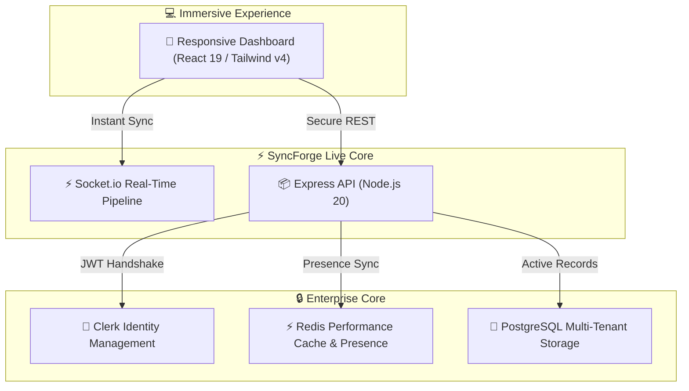
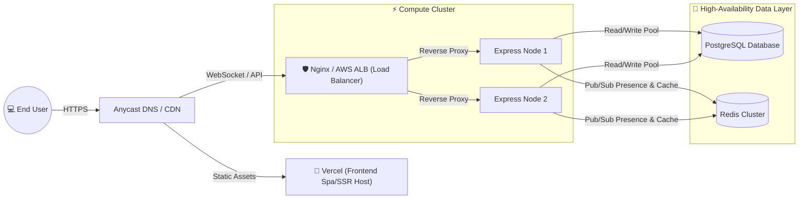

# 🔗 SyncForge — Real-Time Collaborative Workspace

SyncForge is the ultimate real-time collaborative workspace designed for high-performance teams. It bridges the gap between chaotic instant messaging and slow, static task trackers, offering an immersive, context-rich platform where teams plan, execute, and sync in perfect harmony.

---

## ✨ The SyncForge Product Experience

SyncForge consolidates task tracking, team presence, secure authentication, and real-time updates into a single unified dashboard, built to keep engineering and product teams focused and aligned.

### 🚀 Key Product Features

*   **Live Collaborative Taskboards**: Manage, edit, and filter tasks dynamically. Assignees, descriptions, due dates, and statuses update instantly across all active users.
*   **Active Presence & Live Indicators**: Know who is online, typing, or actively viewing task boards in real time. Visual cues prevent double-work and foster natural collaboration.
*   **Granular Team Workspaces (RBAC)**: Create multi-tenant team workspaces with strict Role-Based Access Control (Owner, Admin, Member) to keep proprietary information partitioned and secure.
*   **Contextual File Attachments**: Attach documentation, mockups, or logs directly to individual tasks. Supports up to 10MB per attachment with local disk buffering.
*   **Clerk Identity & Security Boundaries**: Log in securely with enterprise-grade MFA, passwordless sign-ins, and secure sessions managed by Clerk.

---

## ☁️ Deployment Architecture

SyncForge is engineered as a highly modular multi-tier application, making it exceptionally flexible to deploy. The standard production deployment structure separates static frontend assets, web routing, and horizontal storage nodes.

### 📦 Recommended Production Hosting

SyncForge can be deployed seamlessly across modern cloud infrastructure:

1.  **Frontend SPA/SSR (`frontend/`)**:
    *   **Platform**: [Vercel](https://vercel.com/) or [Netlify](https://www.netlify.com/).
    *   **Benefits**: Edge caching, automated branch previews, and out-of-the-box global CDN distribution.
2.  **API Gateway & Backend Compute (`backend/`)**:
    *   **Platform**: [Render](https://render.com/), [AWS ECS (Fargate)](https://aws.amazon.com/ecs/), or [GCP Cloud Run](https://cloud.google.com/run).
    *   **Benefits**: Autoscaling nodes, native Docker support, and automatic health monitoring.
3.  **Database & Caching Layer**:
    *   **Platform**: [Supabase](https://supabase.com/) / [AWS RDS](https://aws.amazon.com/rds/) for PostgreSQL, and [Upstash](https://upstash.com/) / [Redis Enterprise](https://redis.io/) for high-throughput Redis.

---

## 📈 Scaling Strategies

As team sizes and activity grows, SyncForge scales smoothly through the following cloud architectural practices:

### 1. Horizontally Scaling WebSockets
By pairing Express and Socket.io with the **Redis Adapter**, the Socket.io instances share room broadcasts. As API compute instances scale up behind an Application Load Balancer, live updates are seamlessly routed across nodes.

### 2. Cache-Aside Optimization
The database is protected from read-heavy traffic using a sophisticated cache-aside strategy in Redis. Paginated task lists are cached in Redis and instantly invalidated on any task write, ensuring a snappy UI with minimal database load.

### 3. Connection Pooling
PostgreSQL connections are managed via standard pool controls to handle large bursts of concurrent API request routing.

---

## 🔒 Enterprise Security Posture

*   **Zero Credentials Stored**: Authentication is offloaded fully to Clerk. User passwords and session keys never touch our servers, satisfying complex compliance models.
*   **Asymmetric JWT Signatures**: The backend validates requests locally using Clerk’s public JSON Web Key Sets (JWKS) via asymmetric cryptography (RS256), avoiding external auth latency on each request.
*   **Isolated Data Storage**: The application databases and memory layers are deployed inside a Private Virtual Cloud (VPC), isolated behind the API gateway with no external internet ingress.
