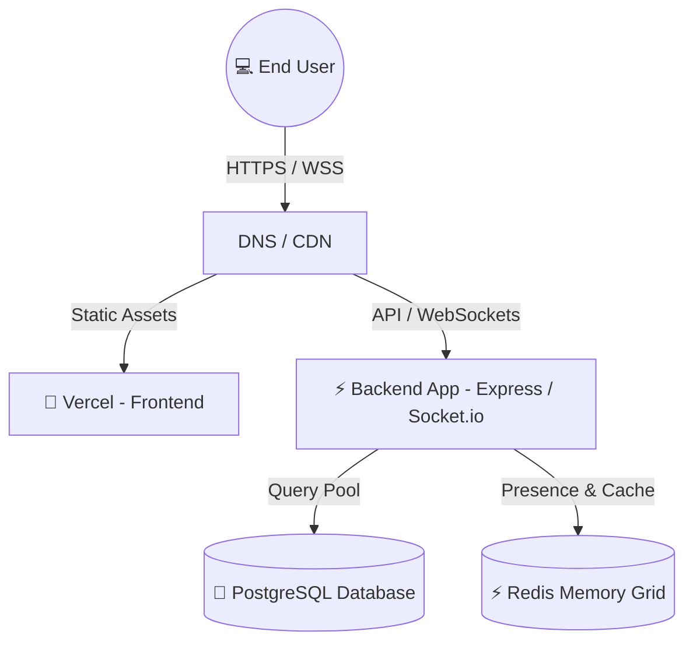
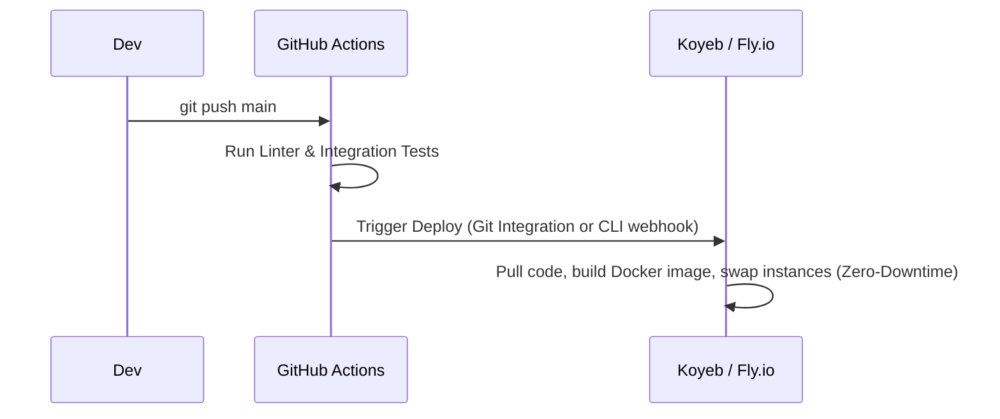

# 🚀 SyncForge Deployment Strategy

This document outlines the production deployment strategy for **SyncForge**. Since SyncForge relies on real-time WebSockets (Socket.io), a persistent relational database (PostgreSQL), and a high-performance memory cache/presence channel (Redis), the deployment architecture must support active, long-lived connections.

We have structured two main strategies tailored to your requirements: **Option A (Zero-Cost Managed PaaS)** and **Option B (Self-Hosted Docker Compose on VPS)**.

---

## 🏗️ Architecture Overview



---

## 🎨 1. Frontend Deployment (Vercel)
The React 19 + Tailwind CSS v4 frontend is highly optimized for Static Site Generation (SSG) and Single Page Application (SPA) hosting.

* **Hosting Provider:** **Vercel (Free Tier)**
* **Deployment Method:** Automatic Git Integration (deployments triggered on push to `main`).
* **Environment Variables Needed:**
  * `VITE_API_URL`: The production URL of your backend server (e.g., `https://api.syncforge.com` or `https://syncforge-backend.koyeb.app`).
  * `VITE_CLERK_PUBLISHABLE_KEY`: Public key for frontend auth.

---

## ⚔️ 2. Backend & Data Tier: Strategy Comparison

### 📍 Option A: The Zero-Cost Managed PaaS Stack (Recommended)
This approach leverages free tiers of multiple managed cloud providers to run a robust, zero-maintenance system without maintaining virtual machines.

| Component | Provider | Tier Details | Why This Choice? |
| :--- | :--- | :--- | :--- |
| **Backend API** | **Koyeb** or **Fly.io** | Free Tier (Always online) | Render's free tier spins down after 15 min of inactivity (causing a 50s delay on cold-start). **Koyeb** and **Fly.io** support Docker deployments, do not sleep on free tiers, and natively support long-lived WebSockets. |
| **PostgreSQL** | **Supabase** | Free Tier (500MB Pg Database) | Dedicated enterprise-grade PostgreSQL with integrated connection pooling (PgBouncer) for high-performance WebSocket traffic. |
| **Redis** | **Upstash** | Free Tier (10k requests/day) | Serverless Redis instance perfect for WebSocket pub/sub connection scaling and real-time user presence tracking. |

#### **Option A Deployment Pipeline (GitHub Actions)**


---

### 📍 Option B: The Self-Hosted Docker Compose Stack
This approach bundles the Express Backend, PostgreSQL, and Redis into a single `docker-compose.yml` config running on a single Virtual Private Server (VPS).

* **Hosting Provider:** **Oracle Cloud Infrastructure (OCI) Free Tier** (100% Free - 4 OCPU, 24GB RAM Ampere VM) or a cheap **Hetzner/DigitalOcean** VM ($4-$5/month).
* **Setup details:**
  * **Docker Compose:** Spins up isolated containers for `backend-api`, `postgres-db`, `redis-cache`, and an `nginx` reverse proxy.
  * **Reverse Proxy:** **Nginx** handles incoming port 80/443 traffic, offloads SSL termination using Let's Encrypt (Certbot), and proxies WebSocket (`/socket.io/`) and API connections to the backend container.
  * **Volume Backups:** Database data is persisted inside a Docker volume mapped directly to the host storage with scheduled backup scripts.

#### **Docker Compose Visual Architecture**
```
      [Internet: Port 80/443]
                │
                ▼
  ┌───────────────────────────┐
  │      Nginx Proxy          │ (Let's Encrypt SSL)
  └─────────────┬─────────────┘
                │
        ┌───────┼───────┐
        ▼       ▼       ▼ (Internal Docker Network)
  ┌──────────┐ ┌──────────┐ ┌──────────┐
  │ Express  │ │ Postgres │ │  Redis   │
  │ Backend  │ │ Database │ │  Cache   │
  └──────────┘ └──────────┘ └──────────┘
```

---

## 🔒 3. Secret & Environment Variables Matrix

The following environment variables **must** be securely injected during the deployment process:

### **Backend Variables (`backend/.env`):**
```bash
PORT=8080
NODE_ENV=production

# Database & Cache (Depending on Strategy)
DATABASE_URL=postgresql://<user>:<password>@<host>:<port>/syncforge
REDIS_URL=redis://:<password>@<host>:<port>

# Authentication (Clerk)
CLERK_PUBLISHABLE_KEY=pk_live_...
CLERK_SECRET_KEY=sk_live_...
CLERK_JWT_KEY="-----BEGIN PUBLIC KEY-----\n...\n-----END PUBLIC KEY-----"

# Security
CORS_ORIGIN=https://syncforge.vercel.app
RATE_LIMIT_WINDOW_MS=900000 # 15 minutes
RATE_LIMIT_MAX=100
```

---

## 📈 4. Zero-Downtime & Rollback Strategy

1. **Zero-Downtime Releases:**
   * **Option A (PaaS):** Koyeb/Fly.io natively handles rolling updates. The new Docker container is built and health-checked *before* traffic is rerouted from the old container.
   * **Option B (VPS):** We use Docker Compose with a health check or a standard rolling script (`docker compose up --build -d --no-deps backend`).
2. **Rollback Plan:**
   * If a production build fails verification, GitHub Actions triggers an immediate rollback to the previous stable Docker image tag, or the PaaS console allows a single-click redeployment of the previous successful build.

---

## 🚀 5. Automated CI/CD (GitHub Actions)

We will provision a `.github/workflows/deploy.yml` file to handle automated builds, tests, and deployment triggers.

```yaml
name: SyncForge Production CI/CD

on:
  push:
    branches: [ main ]

jobs:
  audit-and-test:
    runs-on: ubuntu-latest
    steps:
      - uses: actions/checkout@v4
      
      - name: Setup Node.js
        uses: actions/setup-node@v4
        with:
          node-version: 20
          
      - name: Install & Test Backend
        run: |
          cd backend
          npm ci
          npm run lint
          npm run test
          
  deploy-backend:
    needs: audit-and-test
    runs-on: ubuntu-latest
    steps:
      # Steps to deploy to your chosen backend platform (Koyeb CLI / Docker Push / SSH to VPS)
      - name: Trigger Deployment
        run: echo "Deploying SyncForge Backend..."
```

---

## 📝 6. Next Steps & Recommendation

> [!TIP]
> **Recommendation:** We recommend starting with **Option A (Zero-Cost PaaS Stack)** using **Vercel** + **Koyeb** + **Supabase** + **Upstash**. 
> It provides 100% free hosting with production-grade uptime, zero server management, automated SSL, and scales perfectly without the risk of server downtime or open port vulnerabilities.

**Which strategy fits your preference best for our next step?**
1. **Option A:** Setup Koyeb Docker deployment, Supabase connection, Upstash integration, and Vercel hosting.
2. **Option B:** Configure the VPS environment, write a full multi-container `docker-compose.yml` (backend, pg, redis, nginx), and configure SSH-based CD.
